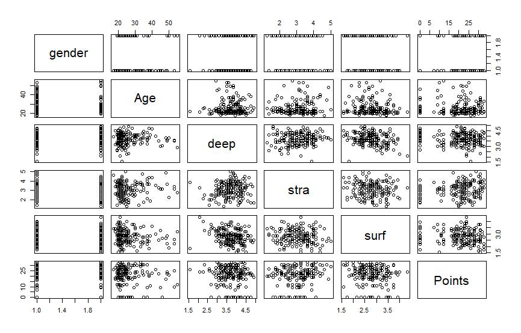
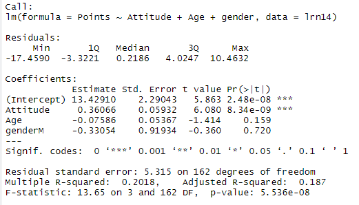
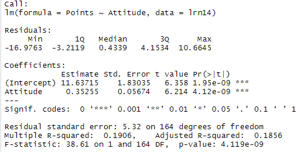
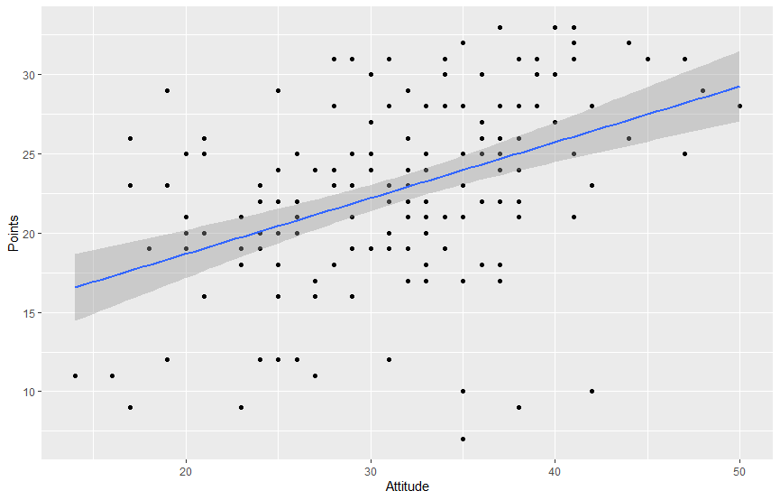
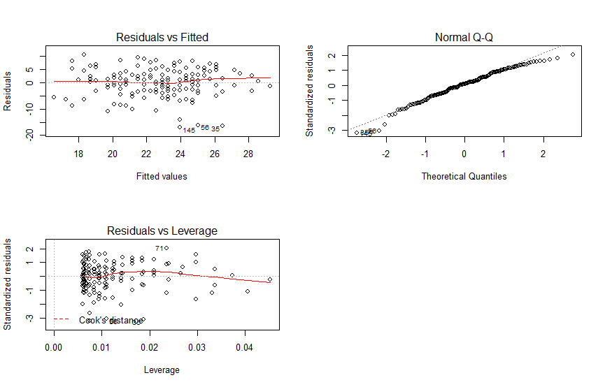

# Chapter 2: Regression and model validation

*Describe the work you have done this week and summarize your learning.*

- Describe your work and results clearly. 
- Assume the reader has an introductory course level understanding of writing and reading R code as well as statistical methods.
- Assume the reader has no previous knowledge of your data or the more advanced methods you are using.

1.
The dataset contains 166 observations with 7 variables (gender ("M" = male/"F" = female), age, attitude toward statistics, avg. of deep learning grades, avg. of strategic learning grades, avg. of surface learning grades and total points).

2.

From the graphical overview of the data I made following observations:
- the distribution of age variable shows that there are more young people (close to their 20s) in the dataset 
- the total points are quite evenly distributed over all ages, however the highest points are achieved by people below 40.
- deep learning grades are higher than othe grades
- attitude seems to correlate heavily with points

3.

I chose Attitude, Age and Gender as explanatory variables:

Age and Gender doesn't seem to have statistically significant relationship with points, so I removed them.

4.

Attitude has an effect of about 0.35 to the total points with a standard error of about 0.057. Since the Pr value is close to zero, we can conclude that the attitude has a statistically significant relationship with the points.

The R-squared statistic provides a measure of how well the model is fitting the actual data. In multiple regression settings, the R2 will always increase as more variables are included in the model. That’s why the adjusted R2 is the preferred measure as it adjusts for the number of variables considered

In this case the attitude has significant effect, but R squared value of 0.20 tells that it's clearly not the only factor. This can be also seen from the simple scatter plot of attitude vs. points.

Using a summary of your fitted model, explain the relationship between the chosen explanatory variables and the target variable (interpret the model parameters). Explain and interpret the multiple R squared of the model. (0-3 points)

5.

Produce the following diagnostic plots: Residuals vs Fitted values, Normal QQ-plot and Residuals vs Leverage. Explain the assumptions of the model and interpret the validity of those assumptions based on the diagnostic plots. (0-3 points)

We assume that the error in our model is normally distributed. The Q-Q plot shows that the normality assumption seems to hold reasonably well.

The constant variance assumption can be evaluated from the Residuals vs fitted plot. There is not a very clear pattern visible, so we can conclude that the assumption holds quite well. However, the spread seems to decrease a little towards the far end of the residuals, which might be a small problem.

The leverage plot shows that some observations have a little more leverage than most, but the relative difference is still quite small (0.01 vs. around 0.04) 
